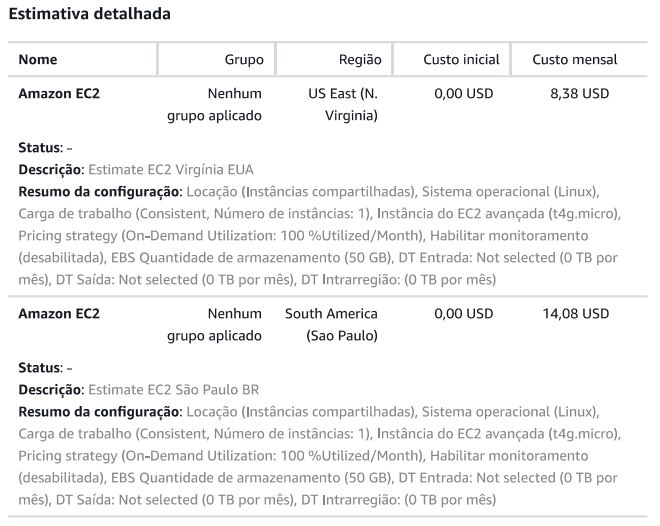

# FIAP - Faculdade de Informática e Administração Paulista

<p align="center">
<a href="https://www.fiap.com.br/"></a>
</p>

<br>

# Fase 5 | Cap 1 – FarmTech na Era da Cloud Computing

## Grupo Aura

## 👨‍🎓 Integrantes:
- Elias da Silva de Souza – RM568500  
- Julia Duarte de Carvalho – RM567816  
- Murilo Salla – RM568041  

## 👩‍🏫 Professores:
### Tutor(a)
- Ana Cristina dos Santos

### Coordenador(a)
- André Godoi Chiovato

## 🔗 Links Importantes

- **GitHub do projeto:** https://github.com/murilosalla-blip/FIAP-Fase5-Cap1-FarmTech-Cloud
- **YouTube Entrega 1:**
- **YouTube Entrega 2:**

---

## 📜 Descrição

### 🌾 Contexto Geral do PBL

Nesta Fase 5, o objetivo é integrar conceitos de **Machine Learning** e **Computação em Nuvem**, considerando um cenário prático no contexto da FarmTech.

Na Entrega 1, foi desenvolvida uma análise completa de dados agrícolas e implementados modelos de regressão para prever a produtividade (Yield) com base em variáveis coletadas por sensores.

Na Entrega 2, foi realizada uma estimativa de custos na AWS para hospedar a solução desenvolvida, comparando diferentes regiões e avaliando aspectos técnicos e legais para tomada de decisão.

---

### 🧠 Parte 1 – Machine Learning (Entrega 1)

O notebook desenvolvido realiza:

- Análise exploratória do dataset `crop_yield.csv`
- Estatísticas descritivas
- Verificação de valores ausentes
- Correlação entre variáveis
- Identificação de outliers
- Aplicação de PCA
- Agrupamento com K-Means
- Implementação de modelos de regressão
- Comparação entre métricas (MAE, RMSE, R²)

#### 📊 Principais conclusões

- A variável **Crop** apresentou forte influência na produtividade (Yield).
- As variáveis climáticas demonstraram baixa correlação linear direta com o Yield.
- O modelo com menor RMSE e maior R² foi considerado o mais adequado para o problema.

A análise permitiu compreender padrões produtivos e reforçou a importância da modelagem adequada para tomada de decisão no agronegócio.

---

### ☁️ Parte 2 – Estimativa de Custos na AWS (Entrega 2)

#### 🎯 Objetivo

Estimar o custo de uma máquina Linux simples para hospedar uma API responsável por receber dados dos sensores e executar o modelo de Machine Learning, comparando as regiões:

- Virgínia do Norte (us-east-1)
- São Paulo (sa-east-1)

#### ⚙️ Configuração exigida pelo enunciado

- 2 vCPU  
- 1 GiB de memória  
- Até 5 Gigabit de rede  
- 50 GB de armazenamento (HDD)  
- 1 instância  
- Uso constante  
- Modelo de pagamento: On-Demand (100%)  

#### 💰 Comparativo de Custos Mensais

| Região | Custo Mensal (USD) |
|--------|--------------------|
| Virgínia do Norte (us-east-1) | 8,38 USD |
| São Paulo (sa-east-1) | 14,08 USD |

#### 📷 Evidência da Simulação



#### 📌 Conclusão – Item 1

A solução mais barata para hospedagem é a região **Virgínia do Norte (us-east-1)**, com custo estimado de 8,38 USD por mês.

#### 📌 Escolha considerando restrições legais – Item 2

Considerando a necessidade de acesso rápido aos dados dos sensores e a restrição de armazenamento no exterior, a opção escolhida seria **São Paulo (sa-east-1)**, garantindo armazenamento dos dados no Brasil e menor latência de acesso.

---

## 📁 Estrutura de pastas

Dentre os arquivos e pastas presentes na raiz do projeto, definem-se:

- **.github**: arquivos de configuração específicos do GitHub.  
- **assets**: arquivos não estruturados do repositório (imagens).  
- **config**: arquivos de configuração do projeto.  
- **data**: datasets utilizados no projeto.  
- **document**: documentos solicitados nas atividades.  
- **scripts**: scripts auxiliares.  
- **src**: código fonte do projeto.  
- **README.md**: guia geral do projeto.  

---

## 🔧 Como executar o projeto — Fase 5

### 1. Criar ambiente virtual

```bash
python -m venv .venv
.venv\Scripts\Activate.ps1
```

Se necessário:

```bash
Set-ExecutionPolicy -Scope Process -ExecutionPolicy Bypass
```

### 2. Instalar dependências

```bash
pip install numpy pandas scikit-learn matplotlib seaborn
```

### 3. Garantir o dataset no local correto

```
data/crop_yield.csv
```

### 4. Executar o notebook

`src/MuriloSalla_rm568041_pbl_fase5_v7.ipynb`

### 5. Executar as células na seguinte ordem

1. Importações
2. Análise exploratória
3. Tratamento de dados
4. PCA e K-Means
5. Modelos de regressão
6. Comparação de métricas
7. Conclusões finais

## 🗃 Histórico de Versão
### **1.0.0 — 21/02/2026**

Entrega da Fase 5 – Capítulo 1
- Implementação completa da análise exploratória do dataset agrícola.
- Aplicação de PCA e K-Means.
- Treinamento e comparação de modelos de regressão.
- Definição do melhor modelo com base em RMSE e R².
- Estimativa de custos na AWS (On-Demand 100%).
- Comparação entre regiões us-east-1 e sa-east-1.
- Definição da solução mais barata.
- Justificativa técnica considerando restrições legais.

## 📋 Licença
  <p xmlns:cc="http://creativecommons.org/ns#" xmlns:dct="http://purl.org/dc/terms/"> <a property="dct:title" rel="cc:attributionURL" href="https://github.com/agodoi/template">MODELO GIT FIAP</a> por <a rel="cc:attributionURL dct:creator" property="cc:attributionName" href="https://fiap.com.br">Fiap</a> está licenciado sobre <a href="http://creativecommons.org/licenses/by/4.0/?ref=chooser-v1" target="_blank" rel="license noopener noreferrer"> Attribution 4.0 International </a>. </p> ```